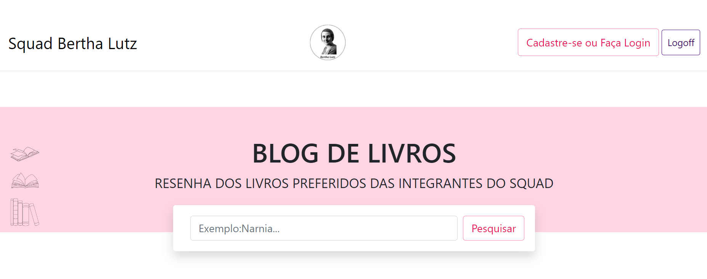
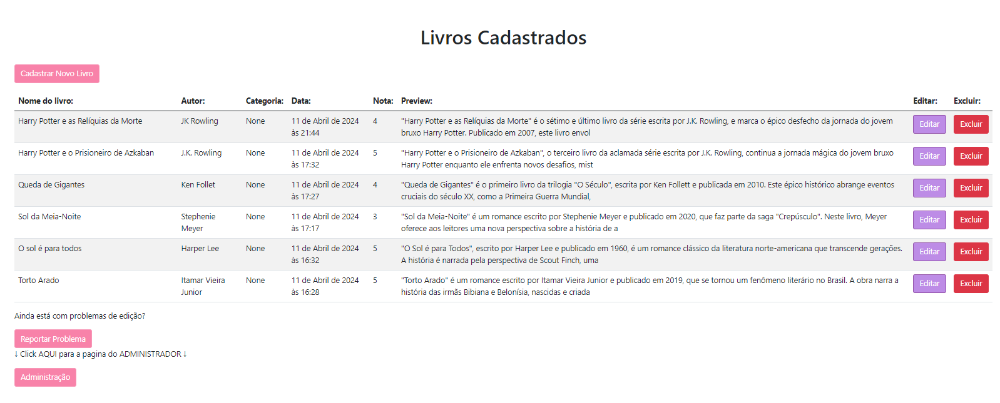
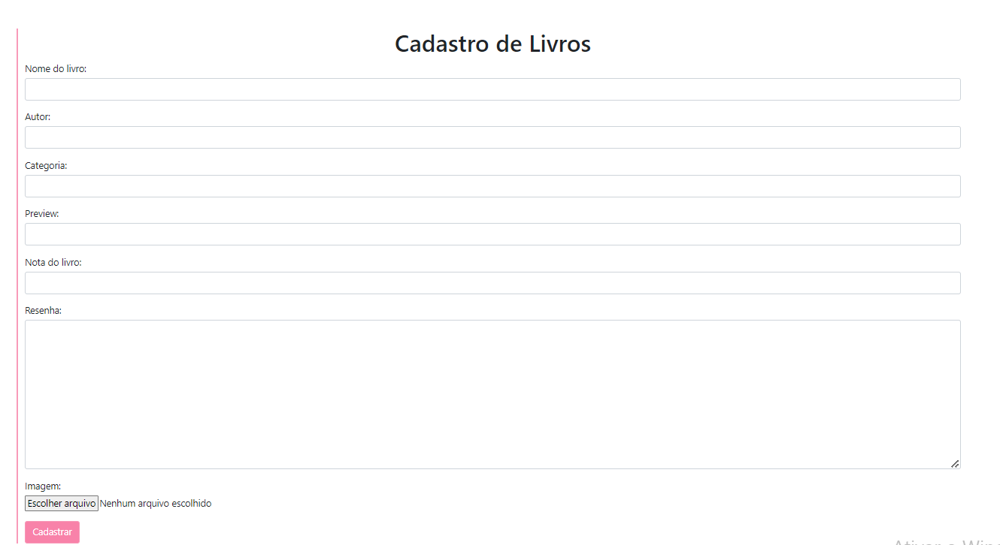
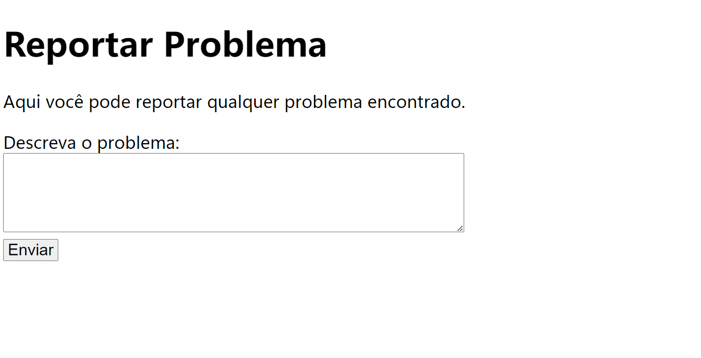
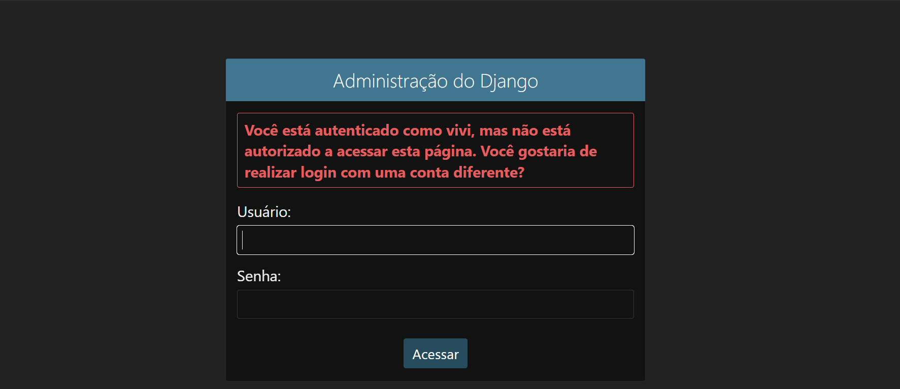

# DESAFIO FINAL / BLOG DE LIVROS 

Projeto Final do Bootcamp de back-end com Python e Django, feito pela WomakersCode. 

Projeto feito com a linguagem Python, utilizando os frameworks Django e Bootstrap-5 e SQLite3.

Feito com amor e em conjunto com as integrantes do Squad Laura Perrone, Leidejane Rosa, Elizabeth Pereira, Adriana Cristina, Raissa Carneiro e Cláudia Azambuja e Vivian Rosana. 

Link do site: https://marianacarla.pythonanywhere.com/ 

## Página inicial:

-----------------------------------------------------------------------------------------------

## Resenha individual do livro:

------------------------------------------------------------------------------------------------

## Página de edição das publicações: 

## Página de cadastro do novo livro

## Página de reporte de problemas com a edição

## Página de Administrador

